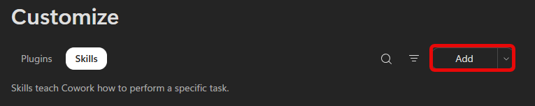
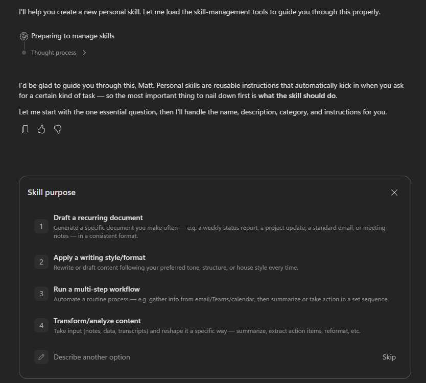

# 🚀 Flight 03: Make It Your Own

**Cleared for solo flight.** Your first two flights walked you through the steps. This one hands you the controls.

Pick one path below based on what's most useful to you. Each is self-contained and takes about 10 minutes. There's no exact prompt to copy this time - you'll brief Cowork yourself and see how far you can take it.

## Choose Your Path {#choose-your-path}

Select a path to expand it. You can switch back anytime.

<!-- markdownlint-disable MD033 -->
<PathChooser>
<template #pathA>

### Path A - Build Your Own Skill {#path-a}

In your last flight, Cowork drafted your update but it read like an assistant wrote it. A **custom skill** fixes that. A skill is a small set of saved instructions Cowork loads automatically whenever a certain kind of task comes up, so you teach it once and it applies every time.

You won't write any code or edit any files. Cowork has a **guided skill builder** that interviews you and assembles the skill for you.

#### Pick something worth teaching

A good first skill captures something you do on a rhythm, or want done a consistent way. Pick one:

- **A recurring document** you produce often - a weekly status, a project update, meeting notes - in a consistent format.
- **Your writing style** - your tone and structure, so drafts come back sounding like you instead of generic.
- **A routine multi-step process** - gather from email, Teams, or calendar, then summarize or act in a set order.

> [!TIP]
> If you came from your last flight, "make my manager update sound like me" is a perfect candidate. It builds directly on the update you just automated.

#### Build it

1. Open [Microsoft 365 Copilot](https://m365.cloud.microsoft/chat/) and select **Cowork**. In the navigation pane, select **Customize**, open the **Skills** tab, and select **Add**.

    

    > [!TIP]
    > Or skip the menu and just tell Cowork what you want, starting with "I'd like to build a skill that ..."

1. From here, Cowork drives. It asks what the skill should do, then follows up on the details - tone, structure, what to always or never do. Answer in plain language, be specific, and keep going until the skill it drafts captures what you want. You can refine the name, description, and instructions anytime.

    

#### Try it out

1. Start a **new conversation** and give Cowork a task that should trigger your new skill - without mentioning the skill by name.

1. Watch the side panel: your skill should load on its own. Compare the result to what you'd have gotten before you built it.

> [!NOTE]
> Your skills live under **Customize** → **Skills**, and each one is saved as a `SKILL.md` file in your OneDrive (under `Documents/Cowork/skills/`). You can edit or remove this one anytime, or ask Cowork to refine it.
>
> **Want to go further?** A skill is just a Markdown file, so you don't have to use the builder. You can write one yourself, or have another AI chatbot draft the `SKILL.md` for you, then add it from the **Skills** page with **Upload Skill**.

#### Did it work? {#path-a-check}

Check your result against these:

- ✅ The skill saved and appears under **Customize** → **Skills**
- ✅ It loaded on its own when you gave a relevant task, without naming it
- ✅ The output reflects the instructions you gave - tone, structure, or steps

</template>
<template #pathB>

### Path B - Delegate the Whole Thing {#path-b}

Most of the time we ask an assistant for one thing: a draft, a summary, a slide. Cowork is built for more than that. Hand it an *outcome* and it chains the steps for you - reading, analyzing, building, and drafting - then hands back a bundle of finished work in one pass.

This path is about that shift: stop asking for a deliverable, start handing off the whole job.

#### Pick a job to hand off

Think about something you'd normally break into several separate prompts (or do by hand). Pick one of these, or bring your own:

- **Prep me for my week** - review my calendar and open threads, build a short briefing for each key meeting, and draft any follow-ups I still owe from last week.
- **Turn this project into a package** - from a tracker or thread, build a status dashboard, write an exec summary email, and draft a team update.
- **Catch me up and tee up action** - summarize a long thread or document, pull out the decisions and open questions, and create a task list grouped by owner.
- **Pick your own** - take something you do regularly and ask for the whole outcome, not just the first piece.

> [!TIP]
> The magic word is *and*. Each example asks for several things at once - that's what tells Cowork to work end to end instead of stopping at the first deliverable.

#### Hand it off

1. Open [Microsoft 365 Copilot](https://m365.cloud.microsoft/chat/), select **Cowork**, and start a **New task**.

1. Give Cowork the context it needs. Use **+** → **Add work context** to point it at the relevant emails, Teams threads, meetings, or files, or attach a file directly. You can also paste in links to documents, SharePoint pages, OneDrive files, websites - whatever Cowork needs to see to do the work.

1. Brief it on the **whole outcome** in one prompt - what to review, what to produce, and how many pieces you want back. Don't split it into separate asks.

1. Watch it work. Cowork plans the steps, loads the skills it needs, and produces each piece. Approve any actions it checks in on, and review what it hands back.

#### Did it work? {#path-b-check}

Check your result against these:

- ✅ One task produced **more than one** finished piece
- ✅ Cowork chained several steps - reading, analyzing, building, drafting
- ✅ It would have taken you multiple separate prompts, or a lot of manual work, to get the same bundle

</template>
</PathChooser>
<!-- markdownlint-enable MD033 -->

## Flight Complete {#flight-complete}

You took the controls and put Cowork to work on your own terms, without a script to follow.

What you saw in action:

✅ **Skills are yours to shape**: The guided builder turns a short back-and-forth into a reusable skill - no files or code required.

✅ **One brief, a bundle back**: Hand Cowork a whole outcome and it chains the steps, instead of stopping at a single deliverable.

[← Back to home](/) · [← Previous flight](/weekly-update/)
