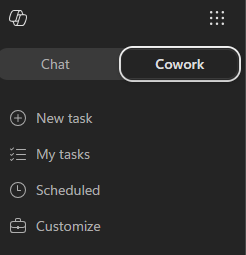
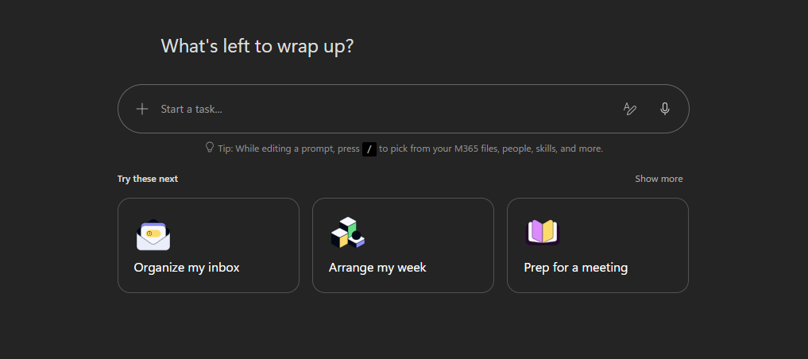
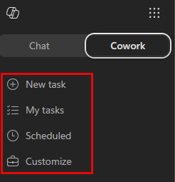
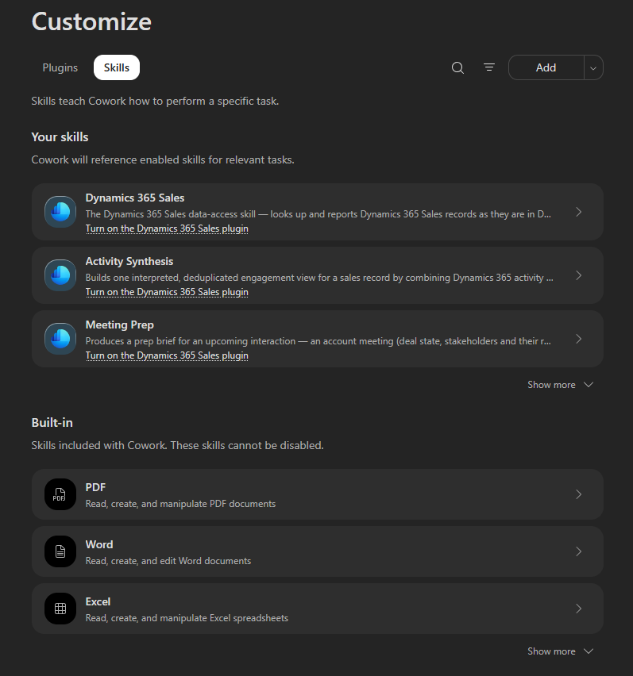
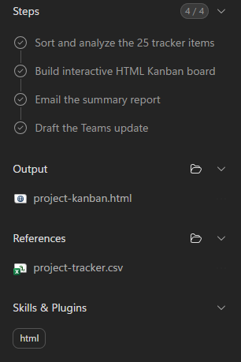

# ✈️ Pre-Flight: Orientation Through Discovery

**Welcome aboard.** This first lab is your pre-flight check: get familiar with Copilot Cowork, find where your skills and controls live, and run your first task - turning a data file into a visual board of open and completed work.

Cowork does the heavy lifting, but you stay in the captain's seat - it checks in for your approval before it acts.

## What You'll Produce {#what-youll-produce}

By the end of this lab, Copilot Cowork will have:

- ✅ Analyzed a data file and identified open vs. completed work
- ✅ Built a self-contained HTML Kanban board you can preview in the conversation
- ✅ Sent you a summary email and drafted a Teams update for your review
- ✅ Shown you which skills it loaded and what it needs your approval for

## What is Copilot Cowork? {#what-is-copilot-cowork}

Copilot Cowork is a new way to delegate work to Copilot. You describe what you need and it works across your Microsoft 365 environment to get it done.

It comes with built-in skills, including:

- **Documents**: Read, create, and edit Word, Excel, PowerPoint, and PDF files
- **html**: Create, edit, and validate standalone single-file HTML
- **Communications**: Audience-adaptive drafting for emails and messages
- **Calendar Management**: Full-spectrum calendar management with classification and automation
- **Skill Management**: Create, validate, and manage your own personal Cowork skills

You can also add custom skills stored in OneDrive. Cowork asks for your approval before taking most actions - you're always in control.

## The Scenario {#the-scenario}

You want a quick snapshot of where your work stands: what's open, what's in progress, and what's done. Instead of building a board by hand, you'll point Copilot Cowork at a project tracker, let it do the analysis, and have it produce a visual board plus two communications. Along the way, you'll learn exactly where Cowork keeps its inputs, outputs, skills, and approvals.

You'll use a sample project tracker so everyone gets a predictable result - but you can swap in your own work context anytime to make it immediately relevant to you.

## Lab Assets {#lab-assets}

This lab uses one source file.

| File | What it contains |
| --- | --- |
| `project-tracker.csv` | 25 fictional tasks across several workstreams, with columns for status, priority, percent complete, start and due dates, owner, and notes. Statuses are a mix of Completed, In Progress, Not Started, and Blocked, so the board fills out nicely. |

<!-- markdownlint-disable-next-line MD033 -->
📥 **Download lab assets:** <a href="/SKL233-AI-Skill-Building-How-to-Use-Cowork/project-tracker.csv" download="project-tracker.csv">project-tracker.csv</a>

## Exercise 1.1 - Find Your Way Around {#exercise1-find-your-way-around}

Before you run anything, learn where the important surfaces live.

1. Open [Microsoft 365 Copilot](https://m365.cloud.microsoft/chat/)

1. Select **Cowork**.

    

    You'll land on the Copilot Cowork homepage. From here you can type a new task in the prompt window, try one of the pre-built task samples, or pick up where you left off from the recent tasks list.

    

    > [!NOTE]
    > Your Copilot Cowork homepage may look slightly different depending on when you access it.

1. In the prompt area, select **+** and note the three ways to add context:

    - **Add work context** - reference files, people, emails, and Teams chats from your organization
    - **Upload images and files** - browse your device
    - **Attach cloud files** - pick from OneDrive, SharePoint, or Teams

1. Look at the **left navigation** under the Cowork tab. This is how you move between your work:

    

    - **New task** - start a fresh task in a clean conversation
    - **My tasks** - return to tasks you've already run
    - **Scheduled** - Review & set up prompts to run automatically on a recurring schedule
    - **Customize** - manage your plugins and skills, including any custom skills you add

1. Select **Customize** and then select the **Skills** tab. Browse through the **built-in skills**. These are the skills Cowork can draw on automatically - you don't have to call them by name. Notice skills like **html**, **Communications**, and **Documents**, which you'll see in action shortly.

    

> [!TIP]
> You don't pick skills manually. Cowork loads the right ones on demand based on what you ask - you'll watch this happen in the next exercise.

## Exercise 1.2 - Run Your First Task {#exercise2-run-first-task}

Now put it together. You'll give Cowork some context to work from, send a task, and watch it build a board, send you a summary email, and draft a Teams update - checking in for your approval as it acts.

1. Attach the sample **project-tracker.csv** you downloaded in [Lab Assets](#lab-assets). Drag and drop it into the conversation, or use **+** → **Upload images and files**.

    > [!TIP]
    > **Want to make it real?** Instead of the sample file, point Cowork at your own work: attach a task list, project tracker, or status spreadsheet you already have, or use **+** → **Add work context** to reference a few recent emails or a Teams chat about an ongoing project. The steps are the same - just expect different results.

1. Add a couple of new lines after the attachment using **Shift + Enter** to make some space, then paste the following prompt:

    ```text
    Help me get a clear picture of where this project stands.

    1. Read through the context I've shared and sort the items into what's open,
       in progress, and done. Call out the few that most need attention.
    2. Build an interactive HTML Kanban board with three lanes - Open / Needs Action,
       In Progress / Monitoring, and Done - plus a compact header showing the total
       item count, how many are open, how many are done, and the single item that most
       needs attention.
    3. Send me a summary report via email.
    4. Write a brief Teams update for a project channel. Don't post it - I just want the draft to review.

    If anything's unclear or missing, ask me one focused question before you start.
    ```

1. Send the prompt by hitting the white circle with the black arrow pointing up in the bottom-right corner.

    > [!NOTE]
    > Depending on your configuration, Cowork may ask you to approve actions (like sending the email to yourself), may auto-approve them, or may check in on how to handle specific tasks. All of these are normal - just follow the prompts.

1. As Cowork works, watch it **think out loud**. It shows a step-by-step progress log, the skills it loads, and the files it produces. Call out what you see:

    - Which **skills** activate (for example, an html skill, then a communications skill)
    - Which files appear in the **output** for you to download or preview
    - Any **references** it used from your work context

        

1. When Cowork finishes, open the **HTML board** it produced to preview it directly in the conversation.

1. Navigate to [Outlook](https://outlook.office.com) and check your inbox. You should have an email from Copilot Cowork.

## What Done Looks Like {#what-done-looks-like}

A successful run looks like:

- An HTML board is generated and previewable in the conversation
- The board clearly separates open, in-progress, and completed items
- You received an email summary in your inbox
- A Teams update draft is prepared (not posted)
- You can point to where skills activated, what Cowork produced, and where it asked for your approval

Quick debrief:

- What did Cowork discover that you didn't expect?
- Which skill activation was most useful here?
- Which action did you hold back from approving, and why?

## Pre-Flight Complete {#pre-flight-complete}

You found your way around Copilot Cowork, ran a discovery-first task, and produced a board, a summary email, and a Teams update draft for review.

What you saw in action:

✅ **Discovery before action**: You asked Cowork to analyze first, then act - sending your summary and holding the Teams post for your review.

✅ **Skills load on demand**: Cowork showed exactly which skills it used to build the board and the communications.

✅ **You stay in control**: Cowork checked in for approval before it acted.
