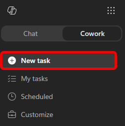
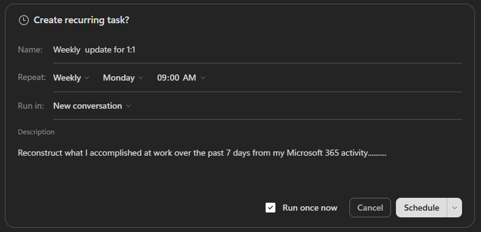

# 🛠️ Flight 02: Your Weekly Manager Update

**Cleared for takeoff.** On your last flight you got oriented. Now you'll put Cowork to work on something you redo all the time: the "here's what I got done" update for your manager 1:1.

You'll have Cowork reconstruct your week from your own Microsoft 365 activity, draft it in a clean structure, then put it on a schedule so it runs without you.

## What You'll Produce {#what-youll-produce}

By the end of this flight, Copilot Cowork will have:

- ✅ Reconstructed your week from sent mail, completed tasks, meetings, and Teams threads
- ✅ Drafted a manager update in a clear structure (Accomplished / Needs input / Looking ahead)
- ✅ Grounded "Looking ahead" in your real upcoming calendar and open tasks
- ✅ Scheduled a weekly run that delivers the update to your own inbox, never to anyone else without your approval

## The Scenario {#the-scenario}

Every week, or right before each 1:1, you stitch together what you actually accomplished: scrolling sent mail, checking off tasks, remembering which meetings mattered. It's useful for your manager but tedious to assemble.

Cowork can reconstruct it from your Microsoft 365 activity in one pass. Then you can put it on a schedule and just review what it leaves waiting.

## Exercise 2.1 - Reconstruct Your Week {#exercise1-reconstruct-your-week}

First, have Cowork rebuild what you accomplished. This is your baseline draft.

1. Open [Microsoft 365 Copilot](https://m365.cloud.microsoft/chat/), select **Cowork**, and start a **New task**.

    

1. Give Cowork your work context. Select **+** → **Add work context** and point it at your recent activity: sent emails, completed tasks, meetings you led or attended, and an active Teams channel or two from the past week.

    > [!TIP]
    > If you're not sure what to reference, just describe the window in your prompt (for example, "the last 7 days") and let Cowork search. Adding a few specific threads or tasks sharpens the result.

1. In the **Start a new task..** prompt field, copy & paste the following prompt:

    ```text
    Reconstruct what I accomplished at work over the past week and email me a concise leadership update I can use in my next 1:1 or manager check-in.
    
    Before writing the update, review my Microsoft 365 activity from the last 7 days, including:
    
    - Sent emails and threads I actively drove
    - Teams chats and channel messages where I contributed meaningfully
    - Meetings I led, presented in, or where I owned follow-up
    - Files I created or edited, including Word, PowerPoint, Excel, Loop, and OneNote
    
    Focus on work that moved something forward. Ignore routine back-and-forth, FYI noise, status-only meetings, and recurring syncs unless they produced a decision, deliverable, or next step.
    
    Send me an email with the following structure:
    
    Accomplished - What shipped, progressed, or became clearer. Be specific. Tie each item to a real artifact, message, email thread, or meeting. Do not include anything you cannot point back to.
    
    Needs input - Open questions, blockers, decisions, or areas where I may want leadership input or help. If there is nothing substantive, write “n/a.”
    
    Looking ahead - Work threads continuing or starting next week. Infer these from this week’s activity and my upcoming calendar, but do not transcribe my calendar. Only name a specific meeting or session if it represents real work I’m driving. Skip routine or recurring syncs. Flag any upcoming OOO, handoffs, or timing risks you can infer.
    
    Keep the update tight enough to skim in under one minute.
    
    If a section is thin, tell me what context I should add rather than padding it. If you are unsure whether something belongs, flag it as uncertain instead of guessing
    ```

1. Send the prompt by hitting the white circle with the black arrow pointing up in the bottom-right corner.

1. Cowork should come back with a draft email ready to send. Review the draft.

    

    For now, select **Cancel**. In the next exercise you'll put this on a schedule so Cowork sends it to you automatically each week.

## Exercise 2.2 - Put It on Autopilot {#exercise2-put-it-on-autopilot}

Now automate it so you never assemble this update by hand again.

1. In the same conversation from Exercise 2.1, send a new prompt:

    ```text
    Schedule this to run weekly on Mondays at 8am
    ```

1. You will be prompted to confirm the scheduled task details:

    

    - **Name**: Give the schedule a name that will help you recognize it in the future, for example "Weekly Manager Update."
    - **Repeat**: Ensure it is set to **Weekly** at 8am (or whatever time you prefer).
    - **Run in**: Select either **New conversation** or **Current conversation**. If you select **New conversation**, Cowork will start a fresh conversation each week. If you select **Current conversation**, it will continue the same thread each week.

    Ensure **Run once now** is selected and then select **Schedule**.

1. Cowork will go through the same steps as before, but this time when presented with the draft, select **Always allow: Only to *your alias*@microsoft.com**

    

Now every week Cowork assembles your update and sends it to your own inbox. You just skim it, tweak if needed, and forward it to your manager.

## What Done Looks Like {#what-done-looks-like}

A successful run looks like:

- A manager-ready update drafted from your real week, in three clear sections
- "Looking ahead" reflects your actual upcoming calendar and open tasks
- A weekly scheduled run is set up that delivers the update to your own inbox and never sends to anyone else without approval

Quick debrief:

- Did Cowork surface anything you'd forgotten you did this week?
- What other recurring write-up could you hand off to a schedule?

## Flight Complete {#flight-complete}

You turned a weekly chore into a one-pass draft and put the whole thing on a schedule.

What you saw in action:

✅ **Real activity in, finished draft out**: Cowork rebuilt your week from your own Microsoft 365 work, not a file you prepared.

✅ **Scheduled, not manual**: The update now runs on its own and lands in your inbox each week, ready to forward.

The draft is accurate, but it probably still reads like an assistant wrote it. On your [next flight](/make-it-your-own/) you'll teach Cowork to write in your voice by building your own custom skill.

[← Back to home](/) · [Next flight →](/make-it-your-own/)
